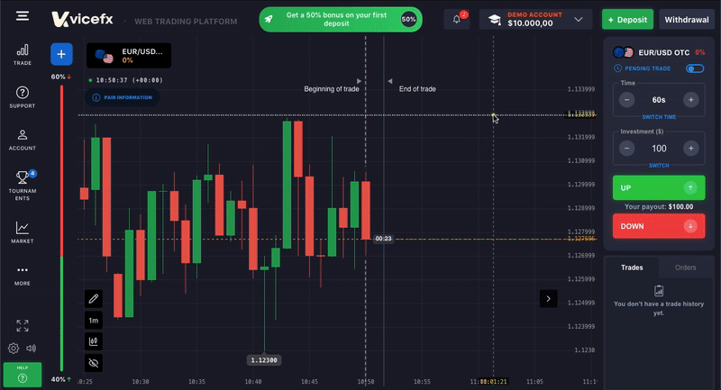

# VICEFX Custom Chart Engine — Showcase Edition

A clean and self-contained demonstration of a **custom high-performance candlestick chart engine** built on top of `lightweight-charts` with fully manual enhancements:

- ✔️ Synthetic live OHLC generator  
- ✔️ Smooth micro-tick price animation (sinusoidal easing)  
- ✔️ Ghost candles (predictive future bars)  
- ✔️ Custom overlay rendering (canvas grid, labels, last-price line)  
- ✔️ Candlestick flip logic  
- ✔️ Zero backend or global context dependencies  
- ✔️ Lightweight, readable, and production-style code  
- ✔️ Perfect for demonstrating low-level chart-engineering skills

This version is intentionally simplified for **professional code review**, derived from the proprietary chart engine built for **VICEFX**.

---

## 📸 Preview



---

## 🚀 Features

### **1. Real-time Synthetic Candles**
Includes a built-in OHLC generator to simulate live market behavior without any backend:
- Updates every second  
- Expands high/low dynamically  
- Produces realistic intrabar movement

---

### **2. Micro-Tick Animation**
Every price update animates smoothly using:
- Sinusoidal easing  
- Zero-lag frame updates  
- Natural “breathing” candle effect  
- High/low auto-expansion  

Perfect for demonstrating animation engineering skill.

---

### **3. Ghost Candles (Future Prediction Bars)**
Automatically generated future bars used to visualize momentum:
- Transparent golden candles  
- Computed on every candle flip  
- Always rendered *below* the live series  
- Shows deep control over custom rendering logic

---

### **4. Custom Overlay Layer (Canvas 2D)**
Manually rendered using `<canvas>` for:
- Horizontal grid  
- Vertical grid  
- Last-price line  
- Price labels  
- Optional markers or drawing layers  

Demonstrates hybrid rendering:  
**Lightweight-charts for candles + Custom Canvas for overlays**.

---

### **5. Clean & Review-Friendly Architecture**
Compared to the full VICEFX chart engine, this showcase excludes:
- Trading UI  
- Backend polling  
- Context providers  
- Multiple canvases  
- Drawing tools  

Just the chart engine core — perfect for recruiters or technical reviewers.

---

## 🧩 Tech Stack

| Technology | Purpose |
|-----------|---------|
| **React** | UI + lifecycle handling |
| **lightweight-charts** | Core candlestick engine |
| **Canvas 2D** | Overlay rendering |
| **ES6+ JavaScript** | Animation pipeline + utilities |

---

## 🛠 Installation

```bash
npm install
npm install lightweight-charts
